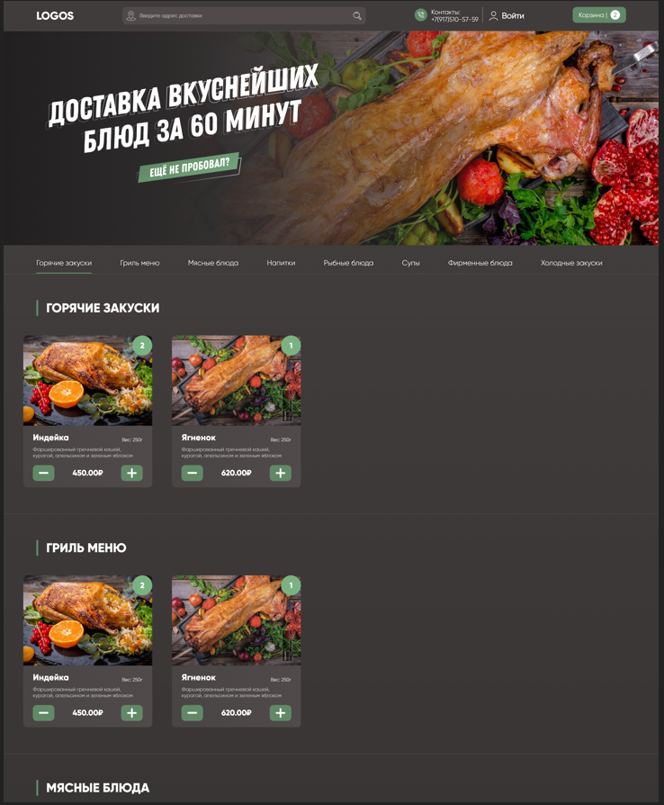
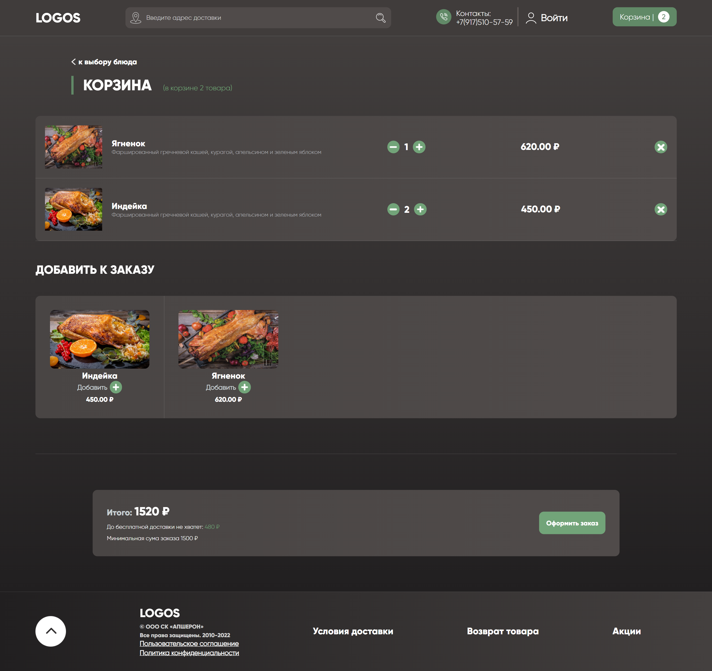

# Restaurant-client

Это клиентская сторона [моего](https://github.com/Ayden-spec) pet-проекта.

Используется: React, React-Redux, React-Router-DOM, React-Google-Maps, Axios.

## Install

Для установки, в каталоге проекта нужно запустить:

### `npm install`

Запускает процесс установки модулей.

### `npm start`

Запускает приложение в режиме разработки.\
Откройте [http://localhost:3000](http://localhost:3000), чтобы просмотреть его в браузере.

## Screenshots

### `Home Page`

### `Basket`

### `Product Card`

